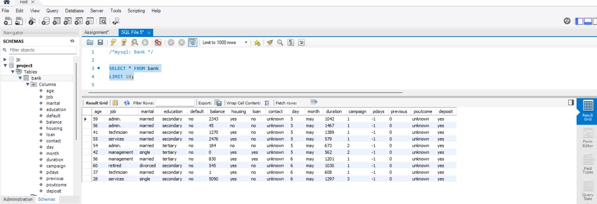

# International debt statistics from the World Bank

## INTRODUCTION

It's not just that we as people take on debt to pay for our needs. A **nation** may also borrow money to run its economy. For instance, one expensive component necessary for a nation's population to live pleasant lifestyles is infrastructure spending. The body that lends money to nations is the World Bank.

## Problem Statment

We will examine data on global debt gathered by The World Bank in this project. The dataset includes data on the total amount of debt (in US dollars) owing by developing nations in several categories. We'll discover the responses to inquiries like:

1. How much debt does each of the nations represented in the dataset have overall?
2. Which nation holds the most debt, and what does that debt look like?
3. What is the average level of debt held by nations according to various debt indicators?

## Skills/Concepts Demonstrated.

The following skills were demonstrated in this project.
- importing csv data to mysql
- sql knowledge.

## 1. Understanding the data

The first line of code establishes a connection to the database **Project**, where the table **named** bank is located. First, let's SELECT data from the **bank** table across all columns. To make the output tidy, we'll also restrict the output to the first ten rows.

## 2. Finding the number of distinct countries

The first ten rows show the various debt indicators and the total amount of debt owed by Afghanistan. However, we are unsure of how many different nations are on the table. Because a country is most likely to have debt in more than one debt indicator, there are repetitions in the country names.

We won't be able to conduct our statistical studies comprehensively without a count of distinct countries. The number of distinct countries contained in the table will be extracted and shown in this section.

