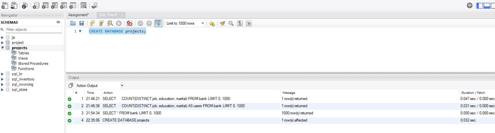
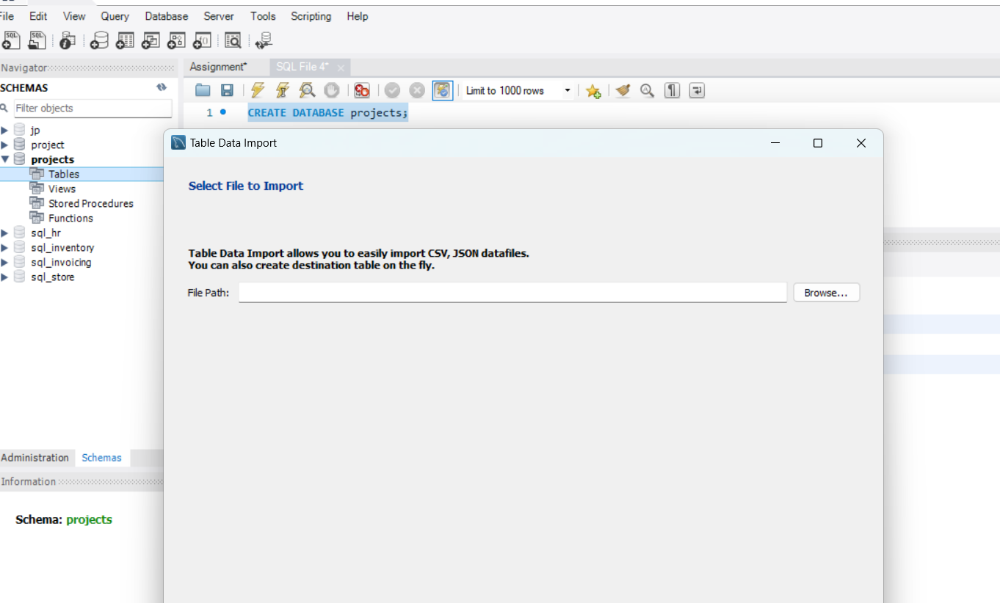
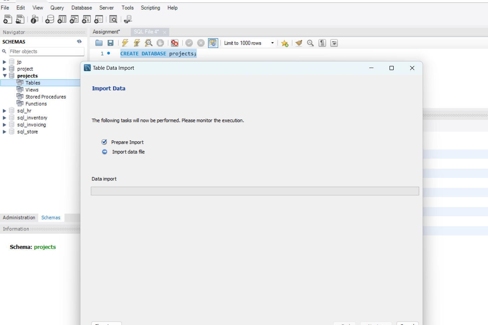
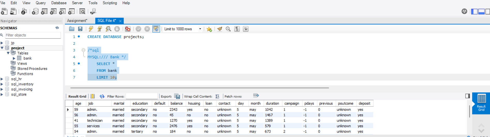
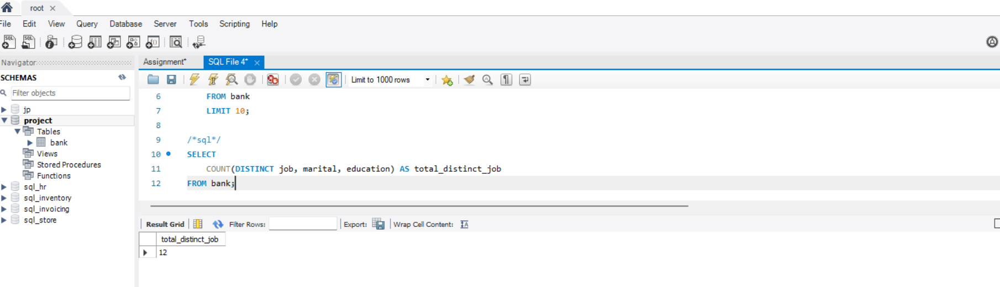
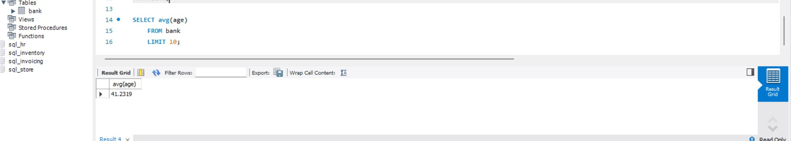
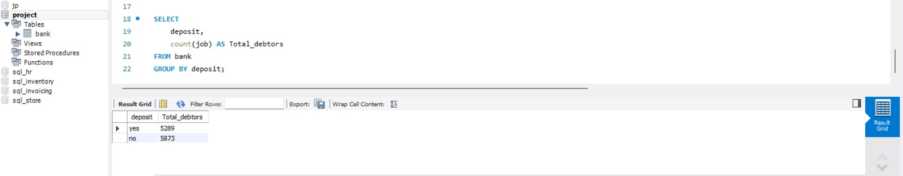
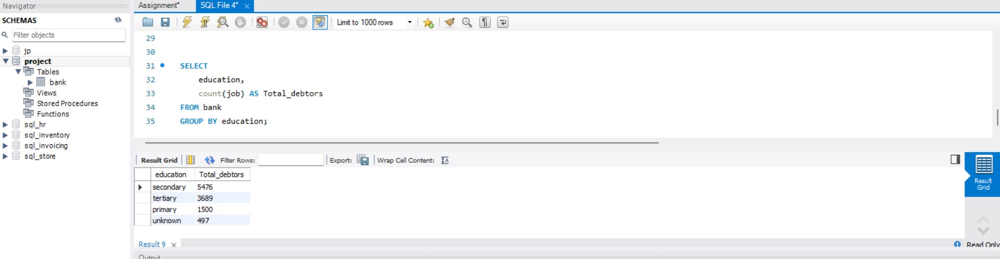
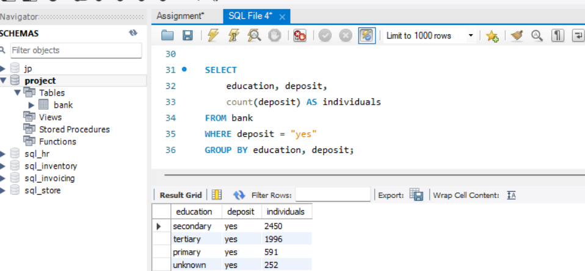

# International debt statistics For Individual Debetors

## INTRODUCTION

It's not just that we as people take on debt to pay for our needs. A **nation** may also borrow money to run its economy. For instance, one expensive component necessary for a nation's population to live pleasant lifestyles is infrastructure spending. We will examine data on global debt gathered by Kaggle on individual loan pattern.

## Problem Statment

We will examine data on global debt gathered by Kaggle in this project. The dataset includes data on the total amount of debt (in US dollars) owing by individuals in several categories. We'll discover the responses to inquiries like:

1. How much debt does each of this individual represented in the dataset have overall?
2. Which individual holds the most debt, and what does that debt look like?
3. What is the average level of debt held by individuals according to various debt indicators?

## Skills/Concepts Demonstrated.

The following skills were demonstrated in this project.
- Importing CSV data to MYSQL
- Data Exploration
- Data Filtering and Aggregation
- Data Analysis
- Sorting and Ranking
- Joining Tables.

## Importing CSV data to MYSQL.
 
 In this section I import the dataset I will be using for the project.
 - First, I created a database named projects.

- Secondly, I used the Table Data import Wizard in MYSQL to import the bank table from my local storage.
 
          

## **Data Exploration**
I performed Data exporation to help understand the dataset better and also perform a statistical analyses holistically.

1. Retrieve the number of records in the dataset. we'll limit the output to the first ten rows to keep the output clean

2. Get the distinct values of categorical variables (e.g., job, education, marital status).

3. Calculate the average age of the clients.

## Data Filtering and Aggregation:

1. Find the number of clients who subscribed to a term deposit.

2. Get the count of clients by education level.

## Data Analysis:
1. Find the education level with the highest success rate for term deposits

2. Calculate the average age of clients who subscribed to a term deposit, grouped by job.
